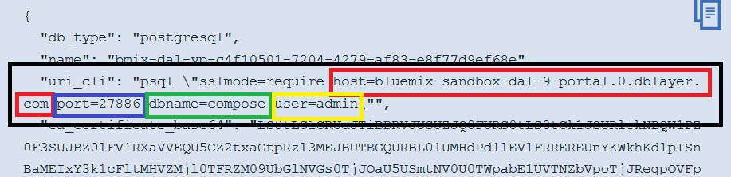

# Django Crud Starter App
This is a simple django app that tests CRUD operations against a database. In this app, you will deploy a postgresql database from IBM Bluemix, connect the database to your app, and then deploy to Bluemix.

These steps will walk you through the process of cloning a template app and connecting to a database from IBM Bluemix. You can then customize the app for whatever data you want.

# Getting Started


## Requirements
This app requires the following:
* [Python 3.6](https://www.python.org/downloads/)
* a Bluemix account
* [Bluemix CLI](https://console.bluemix.net/docs/starters/install_cli.html) or [Cloud Foundry CLI](https://github.com/cloudfoundry/cli#getting-started)
* A Github account and have [git](https://git-scm.com/downloads) installed


# Creating a database
These steps will walk you through how to provision a database in Bluemix and get the service credentials. 

1. Log into Bluemix.
2. Go to the catalog. You can get there by clicking on the "Catalog" button at the top right of most pages within Bluemix.
3. On the left side of the catalog look in the categories section for Services and then select "Data & Analytics". This will filter the catalog to only include services related to data & analytics. This is where you will find the different database offerings in Bluemix.


4. Find the service titled "Compose for PostgreSQL" and click on it. This will open up the service page where we can provision the database. 


5. Click on the blue "Create" button to provision your very own PostgreSQL database on Bluemix. Wasn't that easy?


6. When the service is done being created you will be taken to the service page where you can view the credentials of the database.
7. Click on the "Service Credentials" tab on the left of the page. 
8. On the credentials page, find the table labeled "Service Credentials" and click on "View Credentials" under the "Actions" column. This will expand the credentials for your database. 


We will be coming back to get the credentials later so keep this page open for now. 

# Cloning the project
In these steps, we will cover cloning your very own version of the template application.

Using Git is probably the easiest way to clone projects. 

1. First, open up a terminal or command prompt window and navigate to a project folder where you want your app to live. 
2. Enter the following "git clone" command to create a copy in your own github account and clone the files locally in the directory you are in.

  `git clone https://github.com/odrodrig/django-crud.git`
  
  And just like that you have a copy of the project that you can begin working in.

# Connecting the database to your application
In these steps we will focus on getting your app talking to your database.

1. Open up your cloned project in your favorite code editor.
2. Find the "settings.py" file in the "crud" folder. This is where some important configurations for your app are stored, including database credentials.


3. Scroll down to the section labeled "Databases". 


4. Then, find the database credentials from Bluemix that we found earlier. We are going to be going back and forth between the credentials and the settings.py file. Look for the "uri_cli" entry near the top of the credentials. This has most of the details that we need but we need to parse out what we need.



Red = host
Blue = port
Green = name
Yellow = user

5. Let's start with the "host" field. In uri_cli, copy everything after "host" stopping before "port". Copy that into the "host" section of settings.py.
6. Next, we can do the same thing for the "port" property in settings. Copy everyting in the port variable from uri_cli.
7. Then, let's update the "name" property. Look for "dbname" in uri_cli and copy that into "name" in settings.py.
8. Do the same thing for "user".
9. The only thing left should be password. This one is a little more tricky. In the service credentials, scroll down until you find the "uri" entry. It should look like a long address starting with "postgres". Find "admin" in the address and notice the colon (:). That weird string of characters between that colon and the "@" is your password. Copy that and add it to "password" in your settings.py.


And that's pretty much it. All we have to do now is push the application to Bluemix and play around with it.

# Deploying to Bluemix
This section will cover how to deploy your application to Bluemix
1. Open a terminal or command prompt window
2. Navigate to your project folder that we cloned earlier
3. Make sure you are at the same level as the "requirements.txt" file. 
4. Log into the Bluemix CLI by first running:

  `bluemix api https://api.ng.bluemix.net`
  
  and then:
  
  `bluemix login`
  
  and log in with your bluemix credentials.
  
5. Deploy the app by running the following bluemix command:

  `bluemix app push [app name]`
  
  Except replace [app name] with a unique application name.
  
And with that, you have your own simple CRUD application in Bluemix.

# Using the Application

1. Go to Bluemix and open the route for the app we just deployed. It should be [app name].mybluemix.net except [app name] is whatever you chose to name your app.
2. This first page is the List view or the "R" for "read" in CRUD. Currently, it's empty because nobody has used our app yet. 
3. Click on the "new" link to add somebody to our app. This will take you to the new user page or the "C" for create in CRUD.
4. Enter in a first name, last name, and email address in the form and submit. 
5. After submitting the form you will be taken back to the list view. You should see you entry in the table of users. Click on the "edit" link to take you back into the form view to edit the entry. This represents the "U" for update in CRUD.
6. Change the first name to something else and submit the form again. This will take you to the list view.
7. Lastly, we can delete the entry by clicking the "delete" link. This represents the "D" for delete in CRUD. 
8. On the next page you can confirm that you meant to delete the entry. After confirming the deletion, you will be taken back to the list view. 


# Optional: Customizing the app
Now that we have the app deployed, you can customize the model to store whatever data you need for your application. Roughtly, the steps that you need to follow to customize your app are as follows:

- Update your model by changing or adding new fields.
- Update views to include the new fields from the model
- Update templates to display new fields from model
- Run the makemigrations command locally
- Run migrate command locally
- Push app to cloud

For this next section we will go through the steps defined above to customize the basic CRUD app by adding a new field to the modell.

1. First, locate your models.py file and open it in your code editor of choice. This is where the structure of your data is defined. Currently our app only records first name, last name, and email address. To demonstrate how to customize this model I will add a birthday field.

2. In the models.py file lets add your new field. In my case, I will be adding the birthday field.

  ```python
    birthday = models.DateField(
        default="1971-01-02"
    )
  ```  
  
  Since we already have data in the database, you need to add the default variable and supply a value. This is for the data we already have in the database that was created before changing the model. Without the default that old data would have missing entries for the birthday field.
  
3. Next we need to change the views to incorporate the new fields for our form. Open up the views.py file. The two views that we are concerned with are PeopleCreate and PeopleUpdate which are the create and update views, respectively. 

4. Add your field name to the list of fields for both the PeopleCreate and People update views. Continuing my example, I will add 'birthday' to the list.

`['first_name', 'last_name', 'birthday', 'email']`

5. After updating the views there is only one more code change we need to make. Navigate to your templates folder and open the peopleList.html template. 

First we need to add the table heading for the column. This involves adding another <th> element with the other column headings.

```html
<th class="tg-yw4l">Birthday<br></th>
```

Next, we need to add the table data element in the For loop. The lines that I add are as follows:

  ```html
<td class="tg-6k2t">
  {{ people.birthday }}
</td>
  ```

The completed table now looks like this:

```html
<table class="tg">
            <tr>
              <th class="tg-jbmi">First Name<br></th>
              <th class="tg-yw4l">Last Name<br></th>
              <th class="tg-yw4l">Birthday<br></th>
              <th class="tg-yw4l">Email</th>
              <th class="tg-yw4l">Edit<br></th>
              <th class="tg-yw4l">Delete</th>
            </tr>
            
            <tr>
                <td class="tg-6k2t">
                    {{ people.first_name }}
                </td>
                <td class="tg-6k2t">
                    {{ people.last_name }}
                </td>
                <td class="tg-6k2t">
                    {{ people.birthday }}
                </td>
                <td class="tg-6k2t">
                    {{ people.email }}
                </td>
                <td class="tg-6k2t">
                    <a href="" class="editButton">
                        Edit
                    </a>
                </td>
                <td class="tg-6k2t">
                    <a href="" class="deleteButton">
                        Delete
                    </a>
                </td>
            </tr>
            
        </table>
 ```

6. Now we need to tell the database of the changes we made. Go back to your command prompt and navigate to the same level as the manage.py file. Run the following commands:

`python manage.py makemigrations`

`python manage.py migrate`

7. The last step is to deploy the app to Bluemix again. To do that just run the following command:

`bluemix app push [app name]`

Now you can add birthdays to the users of your application and have them displayed on our table.

These steps that we did above to customize the app only have to be done if you change the model.py file. If you are just making changes to the templates or views then you can just do the push to Bluemix.
